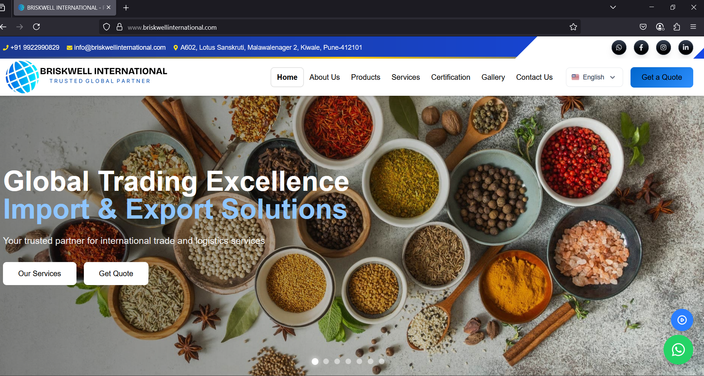

Briskwell International - Business Web Application  

Overview  
Briskwell International is a comprehensive web application for a global trading company specializing in the export of premium Indian agricultural products. The application showcases the company's products, services, and global presence through an intuitive and visually appealing interface.
Features  
  
Multi-language Support: Full internationalization with English and Hindi language options  
Product Showcase: Detailed catalog of agricultural products with filtering capabilities  
Service Information: Comprehensive logistics and global trade services overview  
Interactive Globe Visualization: Visual representation of global distribution network  
Responsive Design: Fully responsive layout adaptable to all device sizes  
Contact Forms: Integrated inquiry and quotation request forms  
Image Gallery: Showcase of company activities and products  
Certification Display: Company accreditations and quality standards  
  
Technologies Used  
Frontend  
  
React.js (v19)  
Vite  
Tailwind CSS  
Framer Motion for animations  
i18next for internationalization  
Three.js for 3D globe visualization  
React Router for navigation  
  
Backend  
  
Node.js  
Express.js  
Nodemailer for email functionality  
  
Installation  
Prerequisites  

Node.js (v18+ recommended)  
npm or yarn  

Setup Instructions  
git clone https://github.com/yourusername/Briskwell-International.git  
cd Briskwell-International  

# Install and start frontend  
cd Frontend  
npm install  
npm run dev  

# In a separate terminal, install and start backend  
cd ../Backend 
npm install  
npm start  
  
Project Structure  
Briskwell-International/  
│  
├── Frontend/  
│   ├── public/  
│   │   ├── locales/        # Internationalization files  
│   │   │   ├── en/         # English translations  
│   │   │   └── hi/         # Hindi translations  
│   │   └── ... 
│   │  
│   ├── src/ 
│   │   ├── assets/         # Images, icons, etc.  
│   │   ├── components/     # Reusable components  
│   │   ├── lib/            # Utility functions  
│   │   ├── pages/          # Page components    
│   │   ├── App.jsx         # Main app component    
│   │   ├── App.css         # Global styles  
│   │   └── main.jsx        # Entry point  
│   │  
│   └── index.html          # HTML template  
│  
└── Backend/  
    ├── index.js            # Express server setup  
    └── ...  
  
  
Usage  
  
The homepage showcases key company information and featured products   
Navigate through the site using the top navigation menu  
Switch languages using the language selector  
Browse products by category in the Products section  
View company certifications and quality standards  
Contact the company through the Contact Us form  
  
Deployment  
The application can be deployed using platforms like Vercel, Netlify (frontend) and Heroku, Render, or any Node.js hosting service (backend).  
Contributors  
  
Prajwal Korade  
Pranav Kamble  

License  
MIT License  
